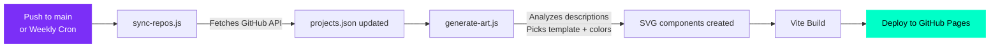

<p align="center">
  
</p>

<p align="center">
  Cyberpunk glassmorphism · Three.js Earth · Auto-synced from GitHub · 20+ live projects
</p>

<p align="center">
  <a href="https://zynztehr.github.io/ZynzTehr-Portfolio/">
    
  </a>
  <a href="https://github.com/ZynzTehr">
    
  </a>
  <a href="https://marketplace.visualstudio.com/items?itemName=VSCodeFX.vscode-fx">
    
  </a>
</p>

---

## What You Get

> **A cinematic developer portfolio** that auto-discovers your GitHub repos, generates themed SVG art, and presents everything in a 3D orbiting showcase — all running on React 19 + Three.js with zero backend.

<table>
<tr>
<td width="50%">

### 3D Earth Globe
High-res procedural planet with night city lights, atmospheric Fresnel glow, and mouse-parallax interaction

### Orbiting Cylinder Carousel
3D perspective carousel with Matrix Digital Rain → bespoke SVG artwork cross-fade on hover

### Click-to-Reveal Archive
Locked archive that initializes on search focus with GSAP stagger + ScrollTrigger batch animations

### 20 Bespoke SVG Artworks
18 hand-crafted + 2 auto-generated vector artworks — one for every project

### Automated SVG Art Generator
Template-based procedural generator that analyzes repo descriptions to create themed artwork for new projects

</td>
<td width="50%">

### Auto GitHub Sync
Node.js + GitHub Actions pipeline that discovers new repos, generates art, and deploys — weekly cron or on push

### Floating Notched Search
Cybernetic outlined input with animated floating label that breaks the top border line on focus

### DevHud + Hex Avatar
Persistent top bar with hexagonal profile badge, live project count, and status indicators

### Project Inspector Modals
Full-detail modals with SVG art, architecture descriptions, tech tags, and direct links

### Mobile-First Responsive
Horizontal snap-scroll carousel on mobile, touch swipe, and compact archive grid

</td>
</tr>
</table>

---

## Tech Stack

<p align="center">
  
  
  
  
  
  
  
  
</p>

---

## Architecture

```
ZynzTehr-Portfolio/
├── .github/workflows/
│   └── deploy.yml              # CI/CD: sync → generate art → build → deploy
├── client/
│   ├── scripts/
│   │   ├── sync-repos.js       # Auto-fetch repos from GitHub API
│   │   └── generate-art.js     # Procedural SVG art generator
│   ├── src/
│   │   ├── components/
│   │   │   ├── Earth3D.tsx     # Three.js globe with textures + shaders
│   │   │   ├── ProjectCarousel.tsx  # 3D orbiting cylinder showcase
│   │   │   ├── DevHud.tsx      # Top HUD bar with hex avatar
│   │   │   ├── HexAvatar.tsx   # Hexagonal profile badge
│   │   │   ├── ScrollWidget.tsx # Physics-driven scroll indicator
│   │   │   ├── ProjectModal.tsx # Full project detail modals
│   │   │   ├── MatrixRain.tsx  # Matrix digital rain canvas
│   │   │   └── project-arts/   # 18 hand-crafted + auto-generated SVGs
│   │   ├── data/
│   │   │   ├── projects.json   # Source of truth (auto-synced)
│   │   │   └── projects.ts     # Category mapping, sorting, types
│   │   ├── pages/
│   │   │   ├── Landing.tsx     # Cinematic intro with letter animation
│   │   │   └── Home.tsx        # Main portfolio page
│   │   └── styles/
│   │       ├── global.css      # Full design system (glassmorphism, animations)
│   │       ├── global.scss     # Particle orbit animations
│   │       └── Modal.css       # Project inspector styles
│   └── package.json
└── README.md
```

---

## Automation Pipeline



**Existing hand-crafted SVGs are never overwritten.** The generator only creates art for new projects that don't have one yet.

---

## Getting Started

```bash
# Clone
git clone https://github.com/ZynzTehr/ZynzTehr-Portfolio.git
cd ZynzTehr-Portfolio/client

# Install
npm install

# Dev server
npm run dev
```

Visit `http://localhost:5173/ZynzTehr-Portfolio/` in your browser.

### Production Build

```bash
npm run build
# Output: client/dist/
```

---

## Design System

| Token | Value | Usage |
|---|---|---|
| `--accent-color` | `#00ffc8` | Primary neon cyan — CTAs, highlights, glow |
| `--purple-glow` | `#7950f2` | Electric violet — secondary accents |
| `--correct` | `#00ff88` | Emerald — success states |
| `--glass-bg` | `rgba(15,15,30,0.85)` | Card backgrounds |
| `--glass-blur` | `blur(14px)` | Glassmorphism backdrop |
| Font: Display | `Orbitron` | Headings, HUD elements |
| Font: Body | `Outfit` | Body text, descriptions |
| Font: Code | `JetBrains Mono` | Tech tags, monospace |

---

## Author

<table>
<tr>
<td>

**Jorge Alberto Bucio** · Full-Stack & Web3 Developer

- [GitHub @ZynzTehr](https://github.com/ZynzTehr)
- [Live Portfolio](https://zynztehr.github.io/ZynzTehr-Portfolio/)
- [VS Code FX Extension](https://marketplace.visualstudio.com/items?itemName=VSCodeFX.vscode-fx)

</td>
</tr>
</table>

---

<p align="center">
  <i>Designed and engineered with 💜 & ⚡ by Jorge Bucio</i>
</p>
